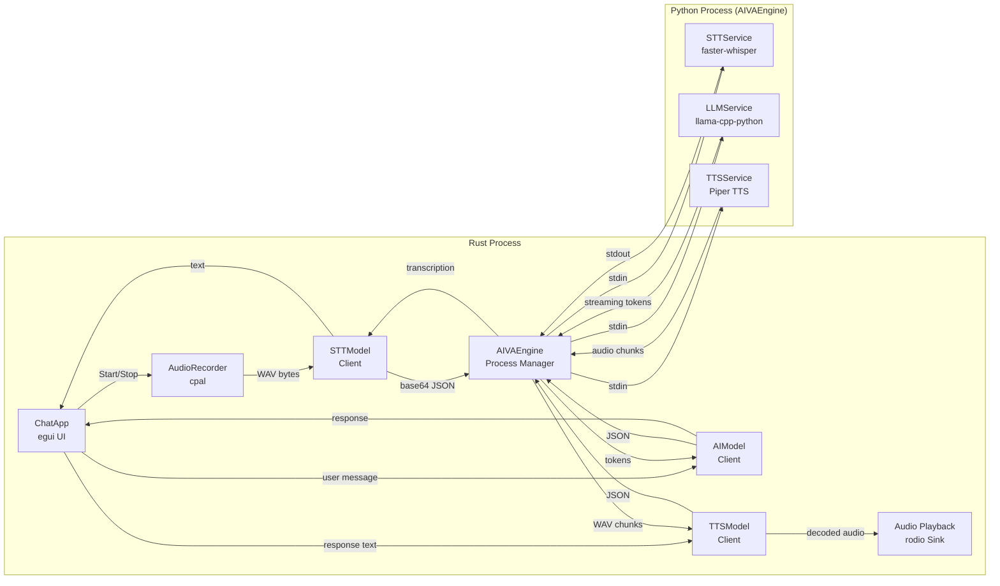
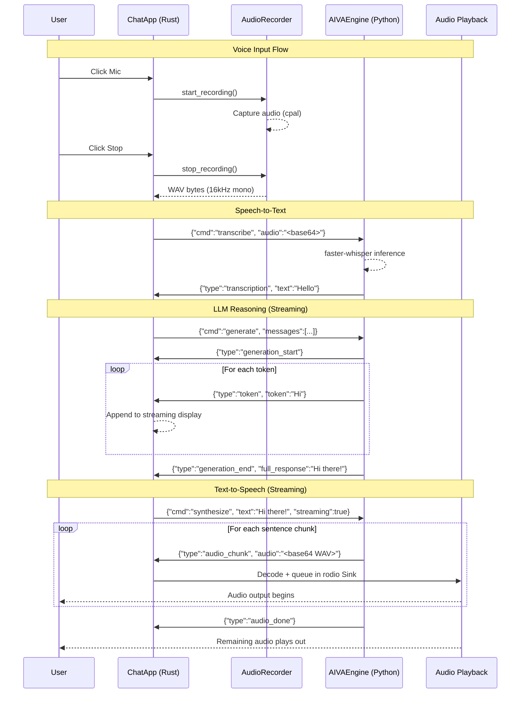

# AIVA Architecture

This document describes the system design of AIVA, a privacy-first local AI voice assistant.

## System Design Narrative

AIVA is a two-process desktop application: a Rust frontend handling the user interface, audio I/O, and process management, and a Python backend running three ML inference services (STT, LLM, TTS) in a single process.

The fundamental design constraint is **latency on CPU hardware**. Every architectural decision optimizes for minimizing the time between the user finishing a spoken question and hearing the first word of the response.

### Component Overview



## Data Flow Walkthrough

### Voice Input Path

1. **Audio Capture** (`src/stt/recorder.rs`): User clicks Mic. The recorder queries the system's default input device via `cpal`, negotiates a sample format (prioritizing F32 > I16 > U16 > I32 > U8), and begins capturing audio into a shared `Arc<Mutex<Vec<f32>>>` buffer. Multi-channel audio is downmixed to mono in the capture callback.

2. **WAV Encoding**: User clicks Stop. The recorder drops the audio stream, claims the sample buffer, resamples to 16kHz if the device didn't support it natively (linear interpolation), and encodes the samples as 16-bit PCM WAV.

3. **STT Transcription** (`src/stt/transcriber.rs`): The WAV bytes are base64-encoded and sent to the Python engine as `{"cmd": "transcribe", "audio": "<base64>"}`. The engine runs faster-whisper with beam search and VAD filtering, returning `{"type": "transcription", "text": "...", "language": "en"}`.

4. **Auto-send**: The transcribed text is automatically placed in the input field and sent as a message, with a flag marking it as a voice input (so the response will also be spoken).

### LLM Reasoning Path

5. **Request** (`src/ai/model.rs`): The full conversation history (user + assistant messages) is sent as `{"cmd": "generate", "messages": [...]}`. The Python engine formats this with the Qwen3 chat template, including the `/no_think` system prompt.

6. **Streaming Tokens**: The engine streams tokens back as individual `{"type": "token", "token": "..."}` messages. The Rust UI appends each token to the streaming response display, giving the user real-time feedback. Think blocks (`<think>...</think>`) are filtered out during streaming.

7. **Completion**: A `{"type": "generation_end", "full_response": "..."}` message signals the end. The full response is added to chat history.

### TTS Output Path

8. **Synthesis Request** (`src/tts/synthesizer.rs`): If the message originated from voice input, the response text is cleaned (markdown stripped, emojis removed, whitespace normalized) and sent as `{"cmd": "synthesize", "text": "...", "streaming": true}`.

9. **Streaming Audio**: Piper TTS synthesizes audio in sentence-sized chunks. Each chunk is encoded as a WAV, base64-encoded, and sent as `{"type": "audio_chunk", "audio": "<base64>"}`. The Rust frontend decodes each chunk and appends it to a `rodio::Sink` for immediate playback.

10. **Playback**: Audio chunks play sequentially through the sink. The user hears the first sentence while later sentences are still being synthesized. An `{"type": "audio_done"}` message signals completion, and the frontend waits for the sink to drain.

### End-to-End Sequence



## Component Interface Contracts

### IPC Protocol

All communication uses **newline-delimited JSON** over stdin/stdout of the Python child process.

**Rust -> Python (commands):**
```
{"cmd": "init", "service": "llm|stt|tts"}
{"cmd": "generate", "messages": [{"role": "user", "content": "..."}]}
{"cmd": "transcribe", "audio": "<base64-wav>"}
{"cmd": "synthesize", "text": "...", "streaming": true}
{"cmd": "ping"}
{"cmd": "quit"}
```

**Python -> Rust (responses):**
```
{"type": "status", "message": "..."}
{"type": "error", "message": "..."}
{"type": "transcription", "text": "...", "language": "en"}
{"type": "generation_start"}
{"type": "token", "token": "..."}
{"type": "generation_end", "full_response": "..."}
{"type": "audio_chunk", "audio": "<base64-wav>", "sample_rate": 22050}
{"type": "audio_done", "total_chunks": 3}
```

### Shared Engine Pattern

The Python backend is a single process (`AIVAEngine`) shared across all three services. On the Rust side, this is modeled as `Arc<Mutex<AIVAEngine>>`. Each service client (AIModel, STTModel, TTSModel) holds a clone of this shared reference and locks the mutex for the duration of a request-response cycle.

This means **requests are serialized** -- only one service can use the engine at a time. This is acceptable because:
- The pipeline is inherently sequential (STT -> LLM -> TTS)
- A single Python process sharing memory is more efficient than three separate processes
- The mutex eliminates protocol interleaving bugs

### UI Message Passing

The egui UI runs on the main thread. All inference happens on background threads. Communication uses `std::sync::mpsc` channels:

- `Sender<AppMessage>` is cloned into each background thread
- `Receiver<AppMessage>` is polled every frame in `check_messages()`
- Message variants: `Token`, `Done`, `Error`, `ModelLoaded`, `STTLoaded`, `TTSLoaded`, `Transcription`, `TTSDone`

## Scalability and Reliability Considerations

### Model Loading

Models are loaded lazily -- the engine starts immediately, and each service initializes on first use. The LLM, STT, and TTS models load sequentially to avoid memory pressure spikes. The UI shows per-service status ("Loading LLM...", "STT ready!", etc.).

### Auto-Download

If a model file is missing, the engine downloads it from the URL configured in `settings.json`. Downloads use chunked transfer with progress reporting back to the Rust UI. A temp-file-then-rename strategy prevents partial downloads from corrupting the model directory.

### Error Recovery

- If the Python engine process dies, the Rust frontend surfaces the error. There is no automatic restart -- this is a desktop app, and a crash indicates a configuration or resource problem that the user should address.
- UTF-8 encoding issues from the LLM (surrogate pairs, invalid sequences) are handled with lossy conversion on the Rust side and explicit sanitization on the Python side.
- Audio device failures produce detailed diagnostics listing available formats to help users troubleshoot hardware issues.

### Distribution

Two packaging modes address different deployment constraints:
1. **Bundled**: PyInstaller compiles the Python backend into a standalone exe. Combined with the Rust exe, models, and settings, the entire app ships as a single ZIP (~500MB-1GB depending on models).
2. **Lightweight**: Ship without models. On first run, models download from configured URLs. Useful when bandwidth isn't a constraint but distribution size is.

## Alternatives Considered

### HTTP/WebSocket instead of stdio
Considered using a local HTTP server for IPC. Rejected because: (1) port conflicts on shared machines, (2) firewall prompts on Windows, (3) process lifecycle complexity (who starts the server? what if it's already running?). Stdio is zero-config and the parent-child relationship gives free lifecycle management.

### All-Rust with ort (ONNX Runtime) bindings
Considered running inference directly in Rust using ort bindings. Rejected because: (1) llama-cpp-python is significantly more mature than Rust GGUF alternatives, (2) faster-whisper's CTranslate2 backend has no Rust equivalent, (3) the Python ecosystem allows rapid model swapping during development. The IPC overhead (~1ms per message) is negligible compared to inference time (~100ms-5s per request).

### Separate processes per service
The initial architecture used three Python processes (llm_server.py, stt_server.py, tts_server.py). This was refactored into a single AIVAEngine process to reduce memory overhead (shared Python runtime, shared numpy/onnxruntime), simplify process management, and eliminate cross-process coordination issues.

### Larger LLM (Qwen 1.5B, Phi-3)
Evaluated larger models for better response quality. At Q4 quantization, Qwen 1.5B requires ~1GB RAM and doubles inference time on CPU. For a voice assistant where concise responses are preferred, the 0.6B model's speed advantage outweighs the quality gap. The architecture supports swapping models via settings.json without code changes.

### Kokoro TTS instead of Piper
Kokoro produces more natural-sounding speech with better prosody. However, Piper's sentence-level streaming and faster synthesis speed result in lower perceived latency. In a voice assistant, hearing a response quickly matters more than hearing it beautifully.
