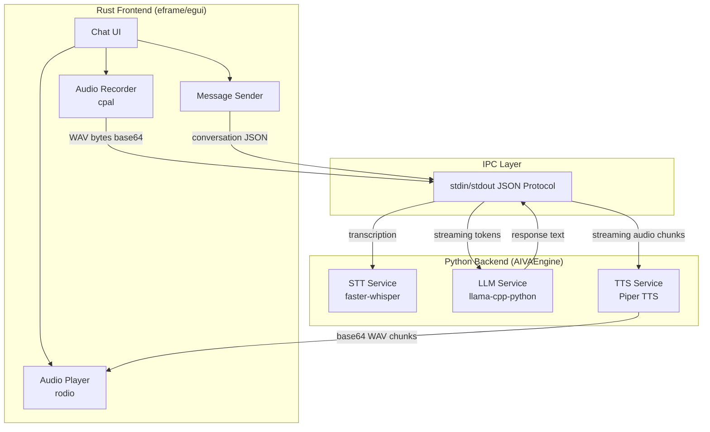

# AIVA - Privacy-First Local AI Voice Assistant

> Offline voice-to-voice AI assistant with <10s end-to-end latency, built on a Rust frontend and Python backend with optimized local inference -- no cloud dependencies.

## About This Repository

This is the complete source code for AIVA -- a privacy-first local AI voice assistant I designed and built as sole developer. The full pipeline (speech-to-text, LLM reasoning, text-to-speech) runs entirely offline on CPU hardware with no cloud dependencies.

For questions about design decisions or the project, feel free to connect on LinkedIn: [linkedin.com/in/kamal-manick](https://linkedin.com/in/kamal-manick)

## Problem Statement

Cloud-based voice assistants send every utterance to remote servers. For enterprise environments handling sensitive data, privacy-first products, and edge deployments, this is a non-starter. AIVA solves this by running the entire voice assistant pipeline -- speech-to-text, language model reasoning, and text-to-speech -- locally on commodity hardware with no network dependency.

The core engineering challenge: achieve acceptable end-to-end latency (<10s from speech input to audio response) using only CPU inference, with models small enough to ship as a desktop application.

## Architecture Overview



## Key Design Decisions

### 1. Piper TTS over Kokoro TTS
I evaluated both Piper and Kokoro for text-to-speech. Kokoro produces noticeably better prosody, but Piper's near-real-time synthesis speed was the deciding factor. In a voice assistant, perceived latency matters more than voice quality -- users need to hear the first audio chunk quickly. Piper's sentence-level streaming lets playback begin while later sentences are still being synthesized.

### 2. Qwen 0.6B as the LLM
The target deployment is CPU-only devices. Qwen3 0.6B in Q4_K_M GGUF quantization fits in ~400MB of RAM and generates tokens fast enough for conversational use. Critically, Qwen 0.6B supports tool calling, which means this assistant can be extended to perform specific tasks (calendar lookup, file search, system commands) without changing the inference stack.

### 3. `/no_think` inference mode
Qwen3 supports a "thinking" mode where it reasons internally before responding. I disable this with `/no_think` in the system prompt. The trade-off: shorter, less deliberate responses in exchange for significantly faster time-to-first-token. For a voice assistant where users expect near-instant replies, this is the right trade-off.

### 4. Stdin/stdout JSON IPC over HTTP or gRPC
The Rust frontend communicates with the Python backend via stdin/stdout JSON lines. This avoids port conflicts, firewall issues, and networking complexity. The Python process is a child of the Rust process -- lifecycle management is trivial (spawn on start, kill on drop). The protocol is dead simple: one JSON object per line, streaming tokens as individual messages.

### 5. Rust frontend / Python backend split
Rust handles the GUI, audio I/O, and process management -- things where startup speed, binary size, and native OS integration matter. Python handles ML inference -- where library ecosystem maturity (llama-cpp-python, faster-whisper, piper-tts) far outweighs performance concerns, since the models themselves dominate execution time.

## Component Breakdown

| Component | Language | Purpose |
|-----------|----------|---------|
| `src/ui/app.rs` | Rust | Main application: egui chat window, message-passing event loop |
| `src/stt/recorder.rs` | Rust | Audio capture via cpal with multi-format support (F32, I16, U16, I32, U8) and resampling to 16kHz |
| `src/stt/transcriber.rs` | Rust | STT client: encodes WAV as base64, sends to engine, reads transcription |
| `src/ai/model.rs` | Rust | LLM client: sends conversation history, reads streaming token responses |
| `src/tts/synthesizer.rs` | Rust | TTS client: sends text, receives and plays streaming audio chunks via rodio |
| `src/backend.rs` | Rust | Process launcher + IPC protocol (spawn Python, read/write JSON lines) |
| `src/chat/` | Rust | Chat history management with bounded buffer |
| `backend/aiva_engine.py` | Python | Combined inference server: LLM + STT + TTS in a single process |
| `backend/build_exe.py` | Python | PyInstaller build script for standalone distribution |
| `package/package.ps1` | PowerShell | End-to-end packaging: builds Rust + Python, bundles models, creates ZIP |

## Tech Stack

| Category | Technology | Why |
|----------|------------|-----|
| Frontend framework | Rust + eframe/egui 0.29 | Native desktop, small binary, immediate-mode UI |
| Audio capture | cpal 0.15 | Cross-platform audio I/O, hardware-adaptive format selection |
| Audio playback | rodio 0.19 | Low-latency streaming playback with sink-based queuing |
| LLM inference | llama-cpp-python + Qwen3 0.6B GGUF | CPU-optimized, quantized, tool-calling capable |
| Speech-to-text | faster-whisper (CTranslate2) | int8 quantized Whisper on CPU, VAD filtering |
| Text-to-speech | Piper TTS (ONNX Runtime) | Near-real-time synthesis, sentence-level streaming |
| IPC | stdin/stdout JSON lines | Zero-config, no networking, trivial lifecycle |
| Config | JSON (settings.json) | Model paths, download URLs, voice parameters |
| Packaging | PyInstaller + Cargo release | Two distribution modes: bundled and download-on-first-run |

## Configuration

Copy `settings.example.json` to `settings.json` and customize:

```json
{
  "models": {
    "llm": {
      "path": "models/model.gguf",
      "download_url": "https://huggingface.co/..."
    },
    "stt": { "cache_dir": "models/hf_cache" },
    "tts": {
      "model_path": "models/tts/piper/model.onnx",
      "download_url": "https://huggingface.co/..."
    }
  },
  "tts_settings": {
    "speaker_id": 0,
    "length_scale": 0.9,
    "noise_scale": 0.6,
    "noise_w_scale": 0.3
  }
}
```

Models are downloaded automatically on first run if not present locally. For air-gapped deployments, place model files in the configured paths before launching.

## Distribution Modes

1. **Bundled** -- `package.ps1` builds everything and packages models into a single ZIP. Users extract and run.
2. **Lightweight** -- Ship the app without models. On first launch, models download from the configured URLs in `settings.json`.

## What I Would Build Next

- **Wake word detection** -- Always-listening mode with a lightweight keyword spotter (e.g., OpenWakeWord) to trigger recording without a button press.
- **Tool calling integration** -- Leverage Qwen's tool-calling capability to connect the assistant to external tools (calendar, file system, APIs) via a pluggable interface.
- **GPU acceleration path** -- Add CUDA/ROCm support for users with discrete GPUs, enabling larger models (Qwen 1.5B+) with faster inference.
- **Conversation persistence** -- Save and resume conversations across sessions with SQLite-backed history.
- **Voice activity detection in the frontend** -- Move VAD to the Rust side to stop recording automatically when the user stops speaking.

## Learnings and Reflection

**Latency is a design constraint, not a metric.** Every architectural decision -- model size, quantization format, streaming granularity, IPC protocol -- was shaped by the <10s latency target. This constraint eliminated many "better" solutions (larger models, HTTP APIs, batch TTS) and forced simpler, faster alternatives.

**The Python/Rust boundary was the right cut.** I initially considered doing everything in Rust, but the ML ecosystem gap is real. Faster-whisper, llama-cpp-python, and piper-tts are mature, well-optimized, and would take months to replicate in Rust. The stdin/stdout bridge costs almost nothing compared to model inference time.

**Audio hardware diversity is underestimated.** The recorder module handles five different sample formats with priority-based selection because real-world Windows audio devices vary wildly. What works on a developer laptop with a USB microphone fails on a conference room system with a 4-channel array. Building the format negotiation logic was more work than expected but essential for reliability.

**Streaming changes everything.** Without streaming, the user waits for the full LLM response, then waits for full TTS synthesis, then hears audio. With per-token streaming and per-sentence TTS chunking, the user starts hearing the response within seconds of the LLM generating its first sentence. The perceived latency improvement is dramatic even though the total compute time is identical.

## Project Structure

```
aiva/
  src/
    main.rs              # Application entry point
    ui/app.rs            # Chat UI and event loop
    ai/model.rs          # LLM client
    stt/recorder.rs      # Audio capture
    stt/transcriber.rs   # STT client
    tts/synthesizer.rs   # TTS client with streaming playback
    backend.rs           # Process launcher and IPC
    chat/                # Chat history management
  backend/
    aiva_engine.py       # Combined inference server
    llm_server.py        # Standalone LLM server
    stt_server.py        # Standalone STT server
    tts_server.py        # Standalone TTS server
    build_exe.py         # PyInstaller build script
    requirements.txt     # Python dependencies
  package/
    package.ps1          # Packaging script
  settings.example.json  # Configuration template
  Cargo.toml             # Rust dependencies
  docs/
    adr/                 # Architecture Decision Records
    diagrams/            # Mermaid diagrams
```

## License

This project is licensed under the [MIT License](LICENSE). AI models used (Qwen3, Whisper, Piper) are governed by their respective licenses -- see [LICENSE](LICENSE) for details.
