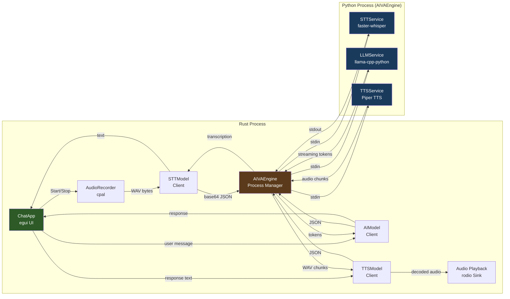

# Component Interaction Diagram

All three service clients (`STTModel`, `AIModel`, `TTSModel`) share a single `AIVAEngine` process via `Arc<Mutex<AIVAEngine>>`. Requests are serialized through the mutex.
