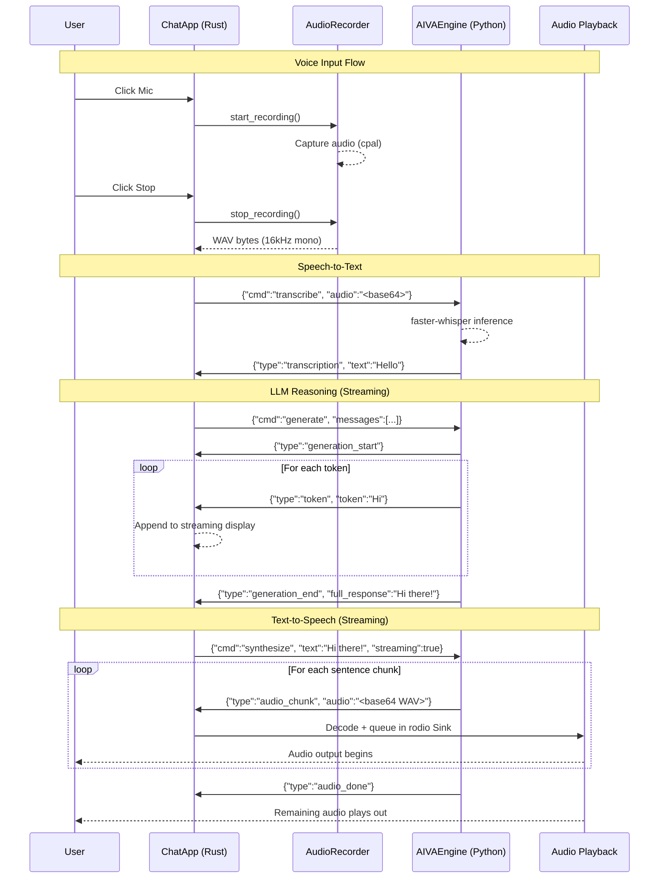

# Data Flow Diagram

Key insight: streaming at every stage means the user hears audio before the full response is generated. The LLM's first sentence triggers TTS synthesis immediately, and playback begins as soon as that first chunk is ready.
