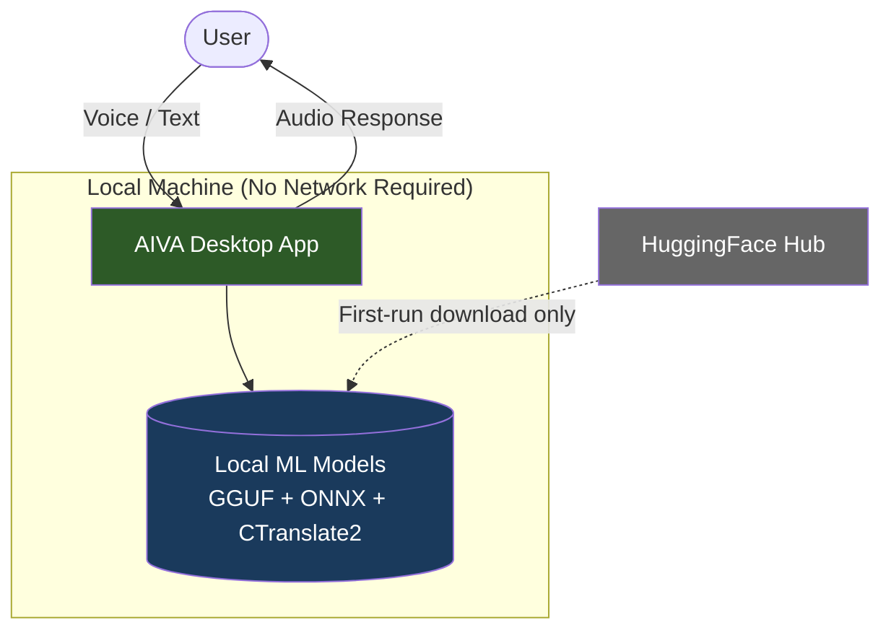

# System Context Diagram

```mermaid
graph TB
    User([User]) -->|Voice / Text| AIVA[AIVA Desktop App]
    AIVA -->|Audio Response| User

    subgraph "Local Machine (No Network Required)"
        AIVA
        Models[(Local ML Models<br/>GGUF + ONNX + CTranslate2)]
        AIVA --> Models
    end

    HF[HuggingFace Hub] -.->|First-run download only| Models

    style AIVA fill:#2d5a27,color:#fff
    style Models fill:#1a3a5c,color:#fff
    style HF fill:#666,color:#fff
```

All inference runs locally. The only network dependency is the optional first-run model download, which can be bypassed by pre-placing model files.
